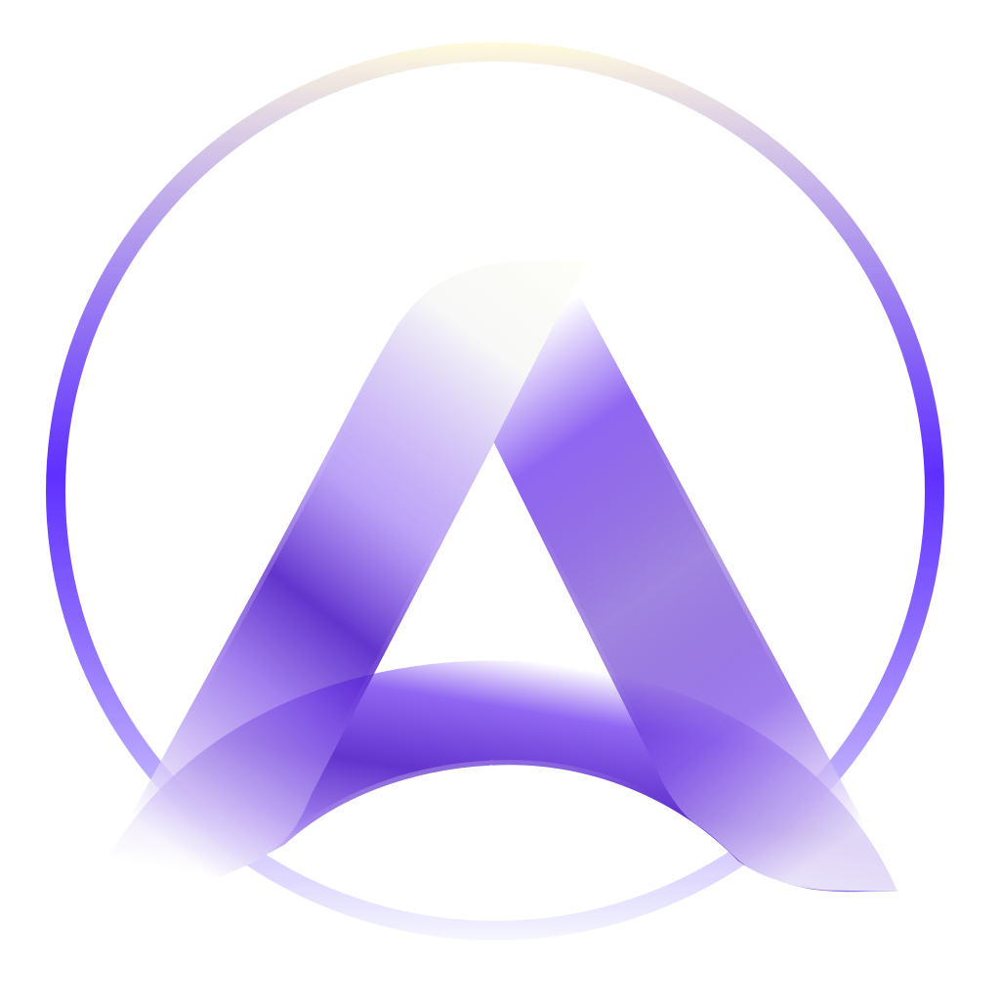
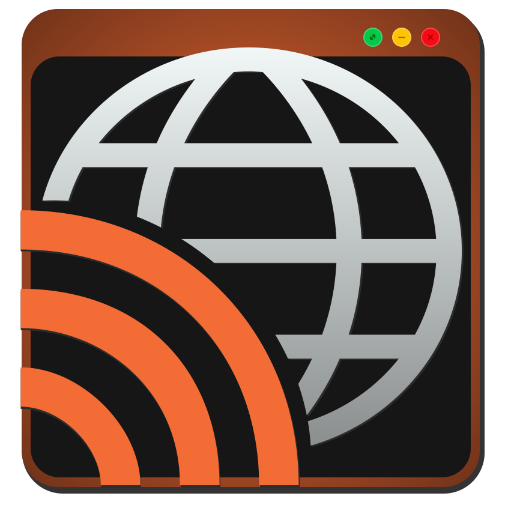
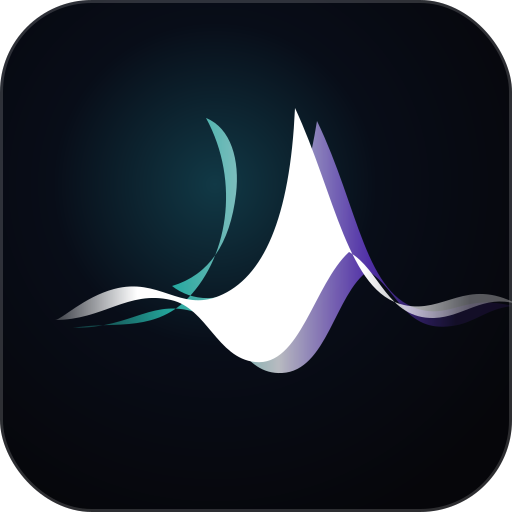

# Matheus Pereira

Software Engineer | Frontend | Web, Data & IoT

## About

Software Engineer focused on frontend, with experience across web interfaces, data workflows, automation, and IoT. I build practical tools and experiments with an emphasis on readable interfaces, performance, accessibility, and codebases that stay easy to evolve.

Most of my public repositories are personal projects built end to end, from interface design and application architecture to deployment and maintenance. They are open source studies and utilities rather than commercial products, but I keep the public demos and descriptions aligned with what each project currently does.

**Areas of Expertise:**

* Frontend applications with React, TypeScript, and JavaScript
* Backend APIs, automation, and integration workflows
* Data analysis and visualization
* Embedded systems and IoT prototyping

---

## Public Projects

The following projects focus on technical exploration, interface work, and useful browser-first tooling. The list includes the projects currently featured in my portfolio plus a few earlier experiments that are still useful references.

| Icon | Project | Description | Links |
| --- | --- | --- | --- |
|  | **AuraWall** | Abstract wallpaper generator with gesture support and dynamic color systems. | [Demo](https://mafhper.github.io/aurawall/) · [Repository](https://github.com/mafhper/aurawall) |
|  | **Fremit** | Code mockup editor with theme support and high-resolution export. | [Demo](https://mafhper.github.io/fremit/) · [Repository](https://github.com/mafhper/fremit) |
|  | **Imaginizim** | Client-side image optimizer focused on performance and privacy. | [Demo](https://mafhper.github.io/imaginizim/) · [Repository](https://github.com/mafhper/imaginizim) |
|  | **Kaes Keide Inspector** | Browser extension for inspecting CSS, HTML, accessibility, assets, and site technology stacks. | [Demo](https://mafhper.github.io/kaes-keide-inspector/) · [Repository](https://github.com/mafhper/kaes-keide-inspector) |
|  | **Mark-Lee** | Desktop Markdown editor focused on writing flow, real-time preview, and polished PDF export. | [Demo](https://mafhper.github.io/mark-lee/) · [Repository](https://github.com/mafhper/mark-lee) |
|  | **Personal News** | Privacy-focused news aggregator with clean design and local-first AI support. | [Demo](https://mafhper.github.io/personalnews/) · [Repository](https://github.com/mafhper/personalnews) |
|  | **Portfolio** | Multilingual portfolio site built with React, Vite, TypeScript, Tailwind CSS, and i18next. | [Demo](https://mafhper.github.io/) · [Repository](https://github.com/mafhper/mafhper.github.io) |
|  | **Push_** | Earlier GitHub dashboard experiment for monitoring repositories, CI/CD failures, security alerts, and activity. | [Demo](https://mafhper.github.io/push_/) · [Repository](https://github.com/mafhper/push_) |
|  | **Sonara Hub** | Local creative studio to organize audio packages and generate reactive ambient videos from your albums, without uploads or cloud dependency. | [Demo](https://mafhper.github.io/sonara_hub/) · [Repository](https://github.com/mafhper/sonara_hub) |
|  | **Spread** | Tool for creating and sharing visually rich content cards. | [Demo](https://mafhper.github.io/spread/) · [Repository](https://github.com/mafhper/spread) |

*"I use these projects to explore useful interfaces, practical tooling, and a free, accessible web."*
